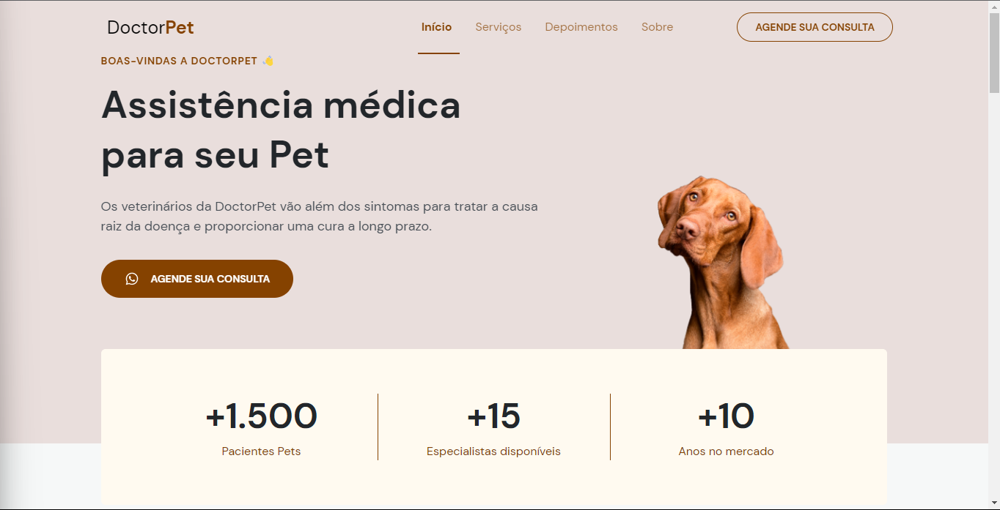
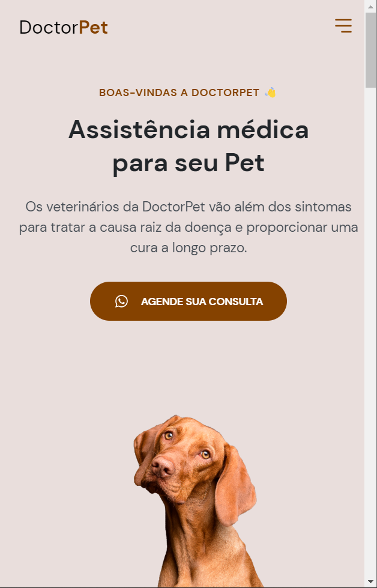

<h1 align="center">LP Pet 🐶</h1>

<p align="center">🔥 Landing Page livre para construir interfaces do<br> usuário com componentes reutilizáveis!</p>

<p align="center">
  <a href="#-executar">Como executar</a> •
  <a href="#-tecnologias">Tecnologias</a> •
  <a href="#-projeto">Projeto</a> • 
  <a href="#-objetivo">Objetivo</a> • 
  <a href="#-roadmap">Roadmap</a>
</p>

<br />

## 💻 Version Web

<br />

<div id="layout" align="center">
  <p align="stretch">
    
    
  </p>
</div>

<br />

Teste você mesmo!!🔎 https://maarcusvinicius.github.io/LP-Pet/

<br />

## 🚀 Como executar

Clone o repositório e acesse a pasta.

```bash
$ git clone https://github.com/maarcusvinicius/LP-Pet.git

Para iniciar o projeto:

# Instalar as dependências
$ npm install / yarn

# Iniciar o projeto
$ npm run / yarn run
```
A aplicação pode ser acessada em [`localhost:5173`](http://localhost:5173).

<br />

## 🔧 Tecnologias

Esse projeto foi desenvolvido com as seguintes tecnologias:

- [HTML](https://developer.mozilla.org/pt-BR/docs/Web/HTML)
- [CSS](https://developer.mozilla.org/pt-BR/docs/Web/CSS)
- [JavaScript](https://developer.mozilla.org/pt-BR/docs/Web/JavaScript)

<br />

## 💻 Projeto

O LP Pet é um projeto que simula uma Landing Page via Web, onde é possível ter todas as informações que precisa para o ambiente e um ótimo design com HTML, CSS e Javascript PURO. Projeto já finalizado!

<br />

## ✅ Objetivo

Me aprofundar mais em Clean Code, CSS puro, HTML e JS puro para criação de futuros projetos frontend, Landing Page acessivel e de fácil compreensão!!

## 🏍️ Roadmap

    - [x] Criar HTML

    - [x] Criar CSS

      - [x] HOME
    
      - [x] MENU EXPANDED
    
      - [x] NAVIGATION

      - [x] SERVICES
      
      - [x] DEPOIMENTS
      
      - [x] ABOUT

    - [x] Criar JarvaScript

    - [x] Configurar responsividade

    - [ ] Versão noturna

    - [x] Versão mobile

    - [x] Versão desktop

    - [x] Deploy

    - [x] Relatório README completo

<h1 align="center">
    
    
</h1>

Teste você mesmo!!🔎 https://maarcusvinicius.github.io/LP-Pet/

<h2 id="tecnologias"> 🛠 Tecnologias </h2>

As seguintes ferramentas foram usadas na construção do projeto:

<div align="center">
  
  
  
</div>


<br>

## License

<p>

This project is licensed under the [MIT License](https://opensource.org/license/mit/). Feel free to use, modify and distribute it as needed.

</p>

<br />
<br />
<br />
<h4 align="center"> 
	✅  LP Pet 🐶 FINALIZADO  ✅
</h4>
<br />

<br />

Feito com ❤️ por Marcus Vinicius 👋🏽 Entre em contato!


//feito readme marcus 


### Olá, sou Marcus 

Sou Desenvolvedor Web, um programador procurando fazer a diferença no mundo digital. [**Profile Github**](https://github.com/maarcusvinicius). 🚀

#### Minhas ferramentas atuais
📲 Front-end Mobile com React Native  
🌎 Front-end Web com Reactjs  
📡 Back-end com Nodejs  
🛠️ Typescript  
🧰 And more...  


#### 💬 Encontre-me em outro lugar

[](https://www.linkedin.com/in/marcus-vinicius-507718228/)
[](marcus.editor77@gmail.com)